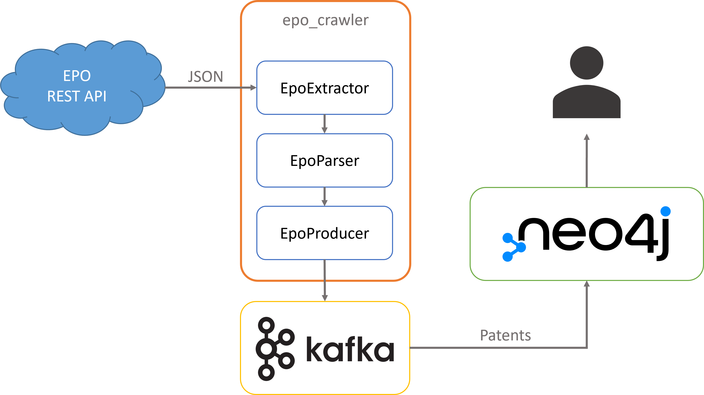

# HPI information integration project SoSe 2022

This repository provides a code base for the information integration course in the summer semester of 2022. Below you
can find the documentation for setting up the project.

## Prerequisites

-   Install [Poetry](https://python-poetry.org/docs/#installation)
-   Install [Docker](https://docs.docker.com/get-docker/) and [docker-compose](https://docs.docker.com/compose/install/)
-   Install [Protobuf compiler (protoc)](https://grpc.io/docs/protoc-installation/). If you are using windows you can
    use [this guide](https://www.geeksforgeeks.org/how-to-install-protocol-buffers-on-windows/)
-   Install [jq](https://stedolan.github.io/jq/download/)

## Architecture


### RB Website

The [Registerbekanntmachung website](https://www.handelsregisterbekanntmachungen.de/index.php?aktion=suche) contains
announcements concerning entries made into the companies, cooperatives, and
partnerships registers within the electronic information and communication system. You can search for the announcements.
Each announcement can be requested through the link below. You only need to pass the query parameters `rb_id`
and `land_abk`. For instance, we chose the state Rheinland-Pfalz `rp` with an announcement id of `56267`, the
new entry of the company BioNTech.

```shell
export STATE="rp"
export RB_ID="56267"
curl -X GET  "https://www.handelsregisterbekanntmachungen.de/skripte/hrb.php?rb_id=$RB_ID&land_abk=$STATE"
```

### RB Crawler

The Registerbekanntmachung crawler (rb_crawler) sends a get request to the link above with parameters (`rb_id`
and `land_abk`) passed to it and extracts the information from the response.

We use [Protocol buffers](https://developers.google.com/protocol-buffers)
to define our [schema](./proto/bakdata/corporate/v1/corporate.proto).

The crawler uses the generated model class (i.e., `Announcement` class) from
the [protobuf schema](./proto/bakdata/corporate/v1/corporate.proto).
We will explain furthur how you can generate this class using the protobuf compiler.
The compiler creates a `Announcement` class with the fields defined in the schema. The crawler fills the object fields with
the
extracted data from the website.
It then serializes the `Announcement` object to bytes so that Kafka can read it and produces it to the `announcements`
topic. After that, it increments the `rb_id` value and sends another GET request.
This process continues until the end of the announcements is reached, and the crawler will stop automatically.

### SQLite Dump Crawler

The SQLite dump crawler fetches HRB data from a SQLite db file and produces the entries to the `announcements` topic in Kafka.

### announcements topic

The `announcements` holds all the events (announcements) produced by the `rb_crawler`. Each message in a Kafka topic
consist of a key and value.

The key type of this topic is `String`. The key is generated by the `rb_crawler`. The key
is a combination of the `land_abk` and the `rb_id`. If we consider the `rb_id` and `land_abk` from the example above,
the
key will look like this: `rp_56267`.

The value of the message contains more information like `event_name`, `event_date`, and more. Therefore, the value type
is complex and needs a schema definition.

### EPO Website and API

The [European Patent Office (EPO)](https://www.epo.org/) lists information regarding European patents. In particular, all patent publications can be accessed via the [website](https://register.epo.org/) or the provided [REST API](https://developers.epo.org/). Each publication contains information such as the titles of the patent; its status; its applicants, inventors and representatives; or the designated states in which the patent is protected. Each publication is identified by a unique ID in the format of `EP<7-digit-id>`, e.g. `EP3995958` (a patent for "ADAPTIVE CLOUD REQUEST HANDLING" by SAP). A publication can be accessed by either querying the web interface or using the provided endpoint directly:

```
https://ops.epo.org/3.2/rest-services/register/publication/epodoc/{id}/biblio
```

However, the API endpoint requires authentication via OAuth. Credentials can be obtained on the [EPO website](https://developers.epo.org/user/register).



### EPO Crawler

The European Patent Office crawler (`epo_crawler`) first authenticates itself with the EPO API by using credentials provided as environment variables (more on that below). It then sends a GET request to the link above with the `epo_id` (`EPxxxxxxx`) passed to it and extracts the information from the response. By default, the response is a XML document but by sending a `Accept: application/json` header the document is delivered as JSON. All request handling logic is implemented in the `EpoExtractor` class.

A `Patent` object is subsequently created based on the corresponding [protobuf schema](./proto/bakdata/corporate/v1/patent.proto) and its fields are filled with the extracted data from the website (see `EpoParser`). The crawler then serializes the `Patent` object to bytes so that Kafka can read it and produces it to the `patent-events` topic (see `EpoProducer`). After that, it increments the `epo_id` value and sends another GET request.
This process continues until either the weekly quota limit of the EPO API is reached or the maximum `epo_id` (EP9999999) is passed.

### ES Dump Crawler

The ES dump crawler fetches EPO data from a ElasticSearch dump file created using [elasticdump](https://github.com/elasticsearch-dump/elasticsearch-dump) and produces the entries to the `patents` topic in Kafka.

### Kafka Connect

[Kafka Connect](https://docs.confluent.io/platform/current/connect/index.html) is a tool to move large data sets into
(source) and out (sink) of Kafka.
Here we only use the Sink connector, which consumes data from a Kafka topic into a secondary index such as
Elasticsearch.

We use the [Elasticsearch Sink Connector](https://docs.confluent.io/kafka-connect-elasticsearch/current/overview.html)
to move the data from the `coporate-events` and `patent-events` topics into the Elasticsearch.

## Setup

This project uses [Poetry](https://python-poetry.org/) as a build tool.
To install all the dependencies, just run `poetry install`.

This project uses Protobuf for serializing and deserializing objects.
You need to generate the Python code for the model class from the proto file.
To do so run the [`generate-proto.sh`](./generate-proto.sh) script.
This script uses the [Protobuf compiler (protoc)](https://grpc.io/docs/protoc-installation/) to generate the model classes under the `build/gen/bakdata/corporate/v1` folder
with the name `corporate_pb2.py` and `patent_pb2.py`.

In order to request the EPO portal using the `epo_crawler`, you have to set authorization information using environment variables `EPO_CONSUMER_KEY` and `EPO_CONSUMER_SECRET`. To do so, you can use a `.env` file in the root directory, which will be loaded by the `epo_crawler` automatically.

## Run

### Infrastructure

Use `docker compose up` to start all the services: [Zookeeper](https://zookeeper.apache.org/), [Kafka](https://kafka.apache.org/), [Schema Registry](https://docs.confluent.io/platform/current/schema-registry/index.html), [Kafka REST Proxy](<(https://github.com/confluentinc/kafka-rest)>), [Kowl](https://github.com/redpanda-data/kowl), [Kafka Connect](https://docs.confluent.io/platform/current/connect/index.html), and [Neo4j](https://neo4j.com/). Depending on your system, it takes a couple of minutes before the services are up and running. You can use a tool like [lazydocker](https://github.com/jesseduffield/lazydocker) to check the status of the services.

### Kafka Connect

After all the services are up and running, you need to configure Kafka Connect to use the Neo4j sink connector.
The config file is a JSON formatted file. We provided basic configuration files for [announcements](./connect/neo4j-sink-announcements.json) and for [patents](./connect/neo4j-sink-patents.json).
You can find more information about the configuration properties on the [official documentation page](https://neo4j.com/labs/kafka/4.0/kafka-connect/).

To start the connector, you need to push the JSON config files to Kafka. You can either use the UI dashboard in Kowl or use the [bash script provided](./connect/push-config.sh). It is possible to remove a connector by deleting it through Kowl's UI dashboard or calling the deletion API in the [bash script provided](./connect/delete-config.sh).

### RB Crawler

You can start the crawler with the command below:

```shell
poetry run python rb_crawler/main.py --id $RB_ID --state $STATE
```

The `--id` option is an integer, which determines the initial event in the handelsregisterbekanntmachungen to be
crawled.

The `--state` option takes a string (only the ones listed above). This string defines the state where the crawler should
start from.

You can use the `--help` option to see the usage:

```
Usage: main.py [OPTIONS]

Options:
  -i, --id INTEGER                The rb_id to initialize the crawl from
  -s, --state [bw|by|be|br|hb|hh|he|mv|ni|nw|rp|sl|sn|st|sh|th]
                                  The state ISO code
  --help                          Show this message and exit.
```

### SQLite Dump Crawler

You can start the crawler with the command below:

```shell
poetry run python sqlite_dump_crawler/main.py -f $FILE
```

The `--file` option is a file path to a SQLite dump file containing HRB data entries (crawled by the RB Crawler).

The `--skip` option takes an integer. This integer defines how many entries of the SQLite dump file should be skipped.

You can use the `--help` option to see the usage:

```
Usage: main.py [OPTIONS]

Options:
  -f, --file TEXT     A path to a SQLite file containing HRB announcements.
                      [required]
  -s, --skip INTEGER  A number how much entries should be skipped
  --help              Show this message and exit.
```

### EPO Crawler

You can start the crawler with the command below:

```shell
poetry run python epo_crawler/main.py -i $EPO_ID
```

The `-i` (or `--id`) option is an integer between 1 and 9_999_999, which determines the initial publication ID in the EPO to be crawled.

The `-s` (or `--single`) flag can be used to only crawl a single patent entry with the given ID. This is useful for debugging if crawling for one specific patent fails.

You can use the `--help` option to see the usage:

```
Usage: main.py [OPTIONS]

Options:
  -i, --id INTEGER RANGE  The patent ID (publication) to initialize the crawl
                          from (number between 1 and 9999999)  [1<=x<=9999999;
                          required]
  -s, --single            Whether a single patent should be crawled. Useful
                          for debugging.
  --help                  Show this message and exit.
```

### ES Dump Crawler

You can start the crawler with the command below:

```shell
poetry run python es_dump_crawler/main.py -f $FILE
```

The `--file` option is a file path to an ElasticSearch dump file created with elasticdump containing EPO data entries (crawled by the EPO Crawler).

You can use the `--help` option to see the usage:

```
Usage: main.py [OPTIONS]

Options:
  -f, --file TEXT  A path to an elasticdump file containing EPO patents.
                   [required]
  --help           Show this message and exit.
```

## Query data

### Kowl

[Kowl](https://github.com/redpanda-data/kowl) is a web application that helps you manage and debug your Kafka workloads effortlessly. You can create, update, and delete Kafka resources like Topics and Kafka Connect configs. You can see Kowl's dashboard in your browser under http://localhost:8080.

### Neo4j

To query the data from Neo4j, you can use the browser GUI ([http://localhost:7474](http://localhost:7474)) of Neo4j. Connect to the database with `neo4j` as username and `test` as password. For example:

```cypher
MATCH (a:Announcement)-->(c:Company { name: <name> })<--(p:Patent)
RETURN a, c, p
```

`<name>` is the company name you wish to search. For example: `"SAP AG"`.

## Teardown

You can stop and remove all the resources by running:

```shell
docker compose down
```
